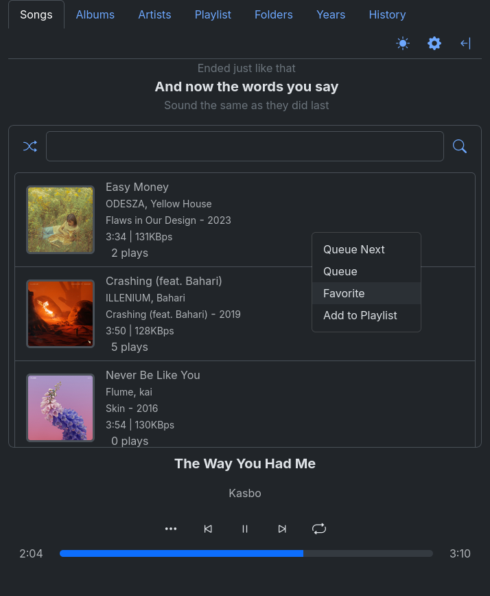
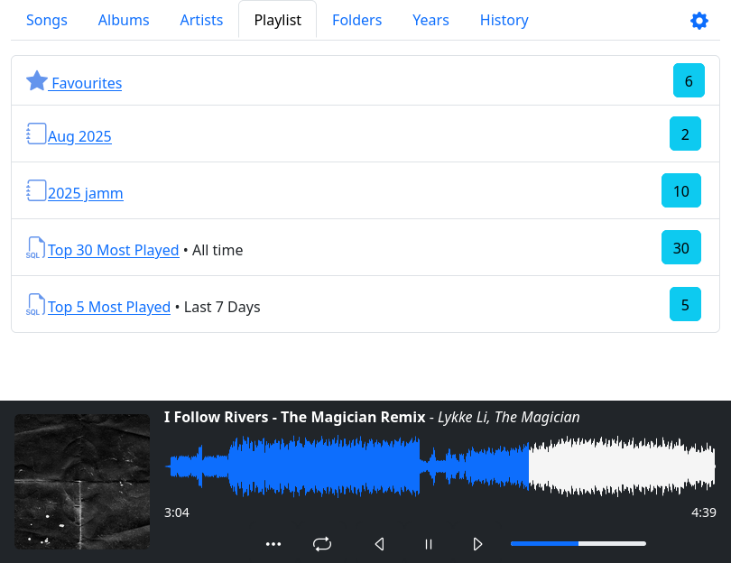
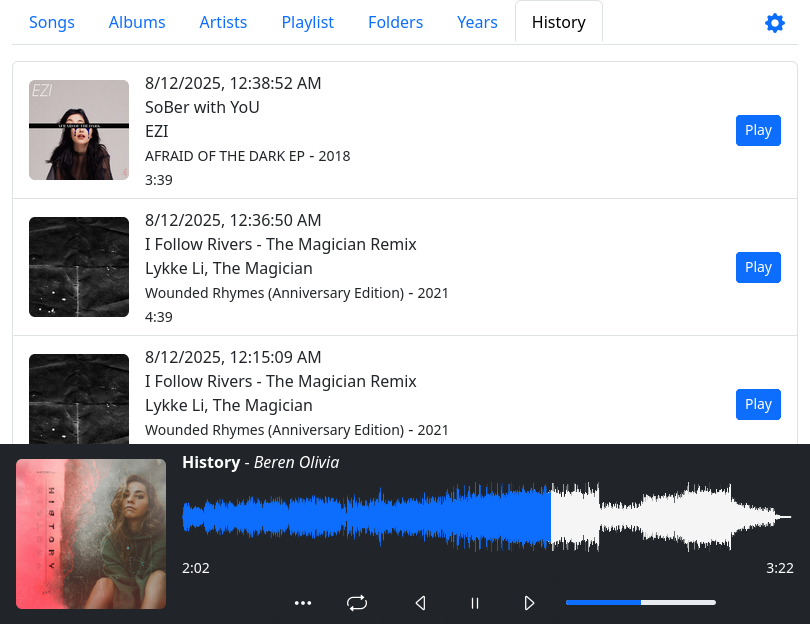
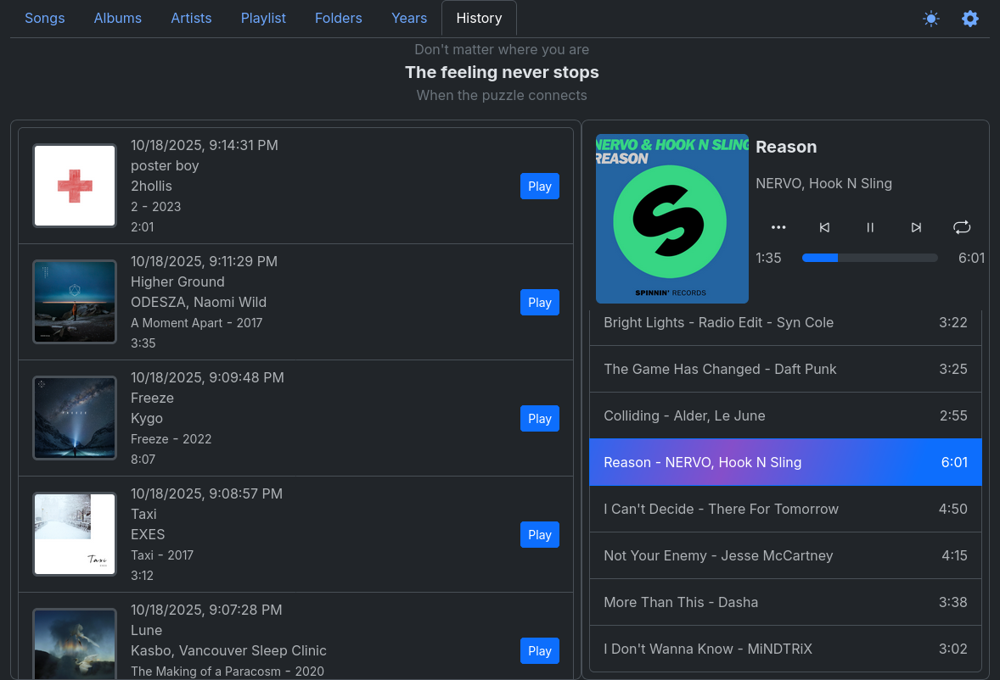

# YAMS

Yet Another Music Server

## Screenshots





## Development

The UI lives in `ui/` and is a Vite + Vue 3 + Tailwind app. `ui/dist` is the
build output, which the Go binary embeds with `go:embed`.

```sh
just dev    # Vite dev server on :5173 (HMR) + the Go API on :5550
just test   # Go tests (builds the UI first, since it is embedded)
just build  # Compile the binary with the UI embedded
just --list # All available recipes
```

`just ui` builds the frontend alone; `just ui-test` and `just ui-check` run the
frontend unit tests and the type checker.

Config lives in `~/.yams/config.json`:

```json
{
    "MusicDir": "/home/user/Music",
    "Ip": "127.0.0.1",
    "Port": 5550
}
```

## Build/Install

```sh
git clone https://github.com/raffleberry/yams.git
just build    # go build -o yams .
just install  # go install .
```

Serve behind a sub-path with `-prefix`:

```sh
yams -prefix=/yams
```

## Keyboard shortcuts

| Key | Action |
| --- | --- |
| `Space` | Play / pause |
| `←` `→` | Seek 10 seconds |
| `Shift` + `←` `→` | Previous / next track |
| `↑` `↓` | Volume |
| `M` | Mute |
| `S` | Toggle shuffle |
| `R` | Cycle repeat mode |
| `/` | Focus search |
